# Speicherprogrammierbare Steuerung (SPS/PLC)

Wozu SPS?:
Davor Festverdrahtete Verbindungslogik &rarr; unflexibel, große Kabelbäume

Definition (IEC 61131):
SPS: "Digital arbeitendes, elektronisches System, entworfen für die Verwendung in einer industriellen Umgebung. Es verwendet einen programmierbaren Speicher zur internen Speicherung von anwenderorientierten Anweisungen, um besondere Funktionen wie Logik, Ablauf, Zeit, Zählen und Arithmetik auszuführen und durch digitale oder analoge Eingänge und Ausgänge verschiedene Typen von Maschinen oder Prozessen zu steuern..."

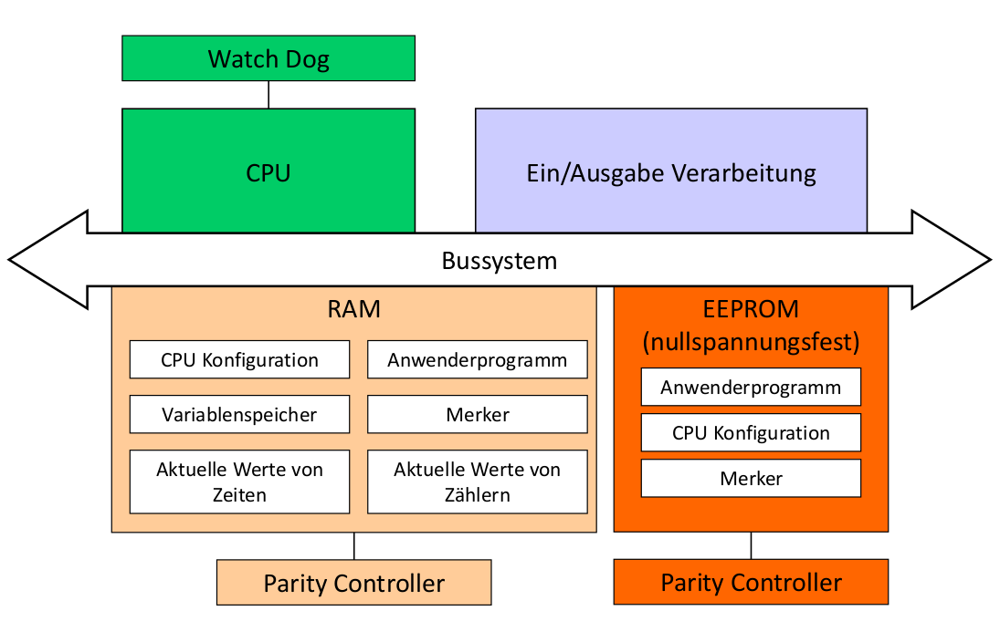

Wie Abbildung \ref{fig:sps_aufbau} illustriert, unterscheidet sich der Aufbau einer SPS von der Architektur anderer Computersysteme z.B. durch die diversen Ein-/Ausgabeschnittstellen und durch besonderes Augenmerk auf Fehlererkennung &rarr; Watchdog für CPU, Parity-Checker für Speicher.

Die Bearbeitung eines SPS-Programms passiert *zyklisch*. In jedem Zyklus werden (nebst Selbstdiagnose) folgende drei Schritte durchgeführt:

#. Prozessabbild der Eingänge erfassen
#. Programm ausführen
#. Prozessabbild der Ausgänge schreiben

Dadurch stehen innerhalb eines Zyklus feste Prozessabbilder zur Verfügung. Außerdem ergeben sich dadurch einige charakteristische Zeiten:

#. Eingangsverzögerung $t_e$: Die Benötigte Zeit für die Übertragung eines Eingangssignals durch diverse Eingangsbausteine in die SPS
#. Eingangsverzögerung $t_a$: analog zu $t_e$
#. Zykluszeit $t_Z$: Die Dauer eines Zyklus der CPU

und schließlich ergibt sich die Worst-Case-Reaktionszeit einer SPS zu $t_R = 2 \cdot (t_E + t_Z + t_A)$

Evolution des Einsatzes von SPSs:

#. Zentralistisches Automationskonzept: SPS ist zentrale Recheneinheit, Daten werden direkt angeschlossen (diskret verkabelt) und transparent gemappt (memory mapped IO).
#. Ergänzung um dezentrales I/O: Klassische Sensor- und Aktuatordaten werden von dezentralem I/O-Modul über Feldbus an SPS weitergegeben. Außerdem können mehrere teilautonome SPSs mit einer übergeordneten Prozessteuerungseinheit kommunizieren.
#. Dezentrales I/O wird mit Intelligenz ausgestattet: Ein-/Ausgabegeräte können kleinstprogramme ausführen, wie etwa zur Sensordatenskalierung
#. Verteiltes, kooperatives Automationskonzept: Intelligenz ist vollständig auf Endgeräte und Knotenpunkte verteilt.

## IEC 61131-3 System Modell

Ein Gehäuse beheimatet eine Konfiguration. Diese wiederum kann mehrere Ressourcen, d.h. CPUs, umfassen. Auf jeder Ressource (also CPU) können mehrere Programme laufen. Zur steuerung der Programme werden Tasks (periodisch oder ereignisgesteuert) eingesetzt. Innerhalb der Programme werden Funktionsbausteine verwedenet.

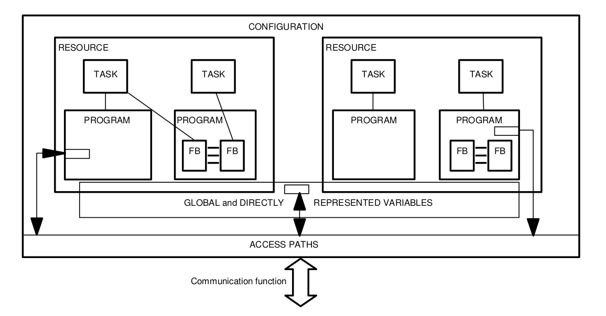

* Programmstruktur: Organisationsbausteine, Funktionen und Funktionsbausteine (interne Zustände)
* Zurverfügungstellung von Standardfunktionen und -bausteinen
* Festlegung von Datentypen und -formaten:
	* direkte bit-, byte-, wort- oder doppelwort-weise Adressierung
* div. Programmiersprachen:
	* KOP (Kontaktplan): graphische Programmiersprache, an elektrische Schaltpläne angelehnt. Schalter als Eingänge, Spulen als Ausgänge, Boxen für komplexere Funtionen
	* Funktionsplan (FBS): modellierung von Datenfluss, logische Verknüpfung von Funktionsbausteinen
	* Anweisungsliste (AWL): ähnlich wie Assambler
	* Strukturierter Text (ST): ähnlich wie Pasclal
	* Ablaufsprache (AS): Hybrid zwischen graphischer und textueller Programmiersprache, gut geeignet für Steuerung von Abläufen

Funktionsblöcke: klar definiertes Eingangs-/Ausgangsinterface, innere Logik kann in belieber Sprache definiert werden &rarr; gute Wiederverwendbarkeit auch zwischen verschiedenen Sprachen. In IEC 61131-3 sind auch objektorientierte Mechanismen vorgesehen.

Kommunikation zwischen unterschiedlichen Einheiten:

* zwischen Funktionsblöcken: direkte Verbindung von Ausgang des einen Blockes zum Eingang des anderen
* zwischen Programmen: über globale Variablen (stehen gesamter Konfiguraiton zur Verfügung)
* zwischen Konfigurationen: über Kommunikationsbausteine mittels `send` und `receive` oder über Zugriffspfade

## IEC 61499 Referenzmodell

Referenzmodell zum Aufbau von verteilten Automatisierungssystemen

Konzept von Funktionsblöcken wurde wieder aufgegriffen und erweitert: nicht bloß Datenschnittstellen, sondern auch Ereignisschnittstellen. Vergleichbar mit  Model-View-Control-Sichtweis

Ziele des Standards:
* Portabilität
* Interoperabilität
* Konfigurierbarkeit

Daher stärkere Kapselung von Funktionen und Augenmerk auf Wiederverwendbarkeit, auch um wachsende Komplexität in den Griff zu bekommen.

Event-Flow und Data-Flow sind verbunden: Eingangsseitig wird durch ein Event signalisiert, wenn bestimmte Daten zur Verfügung stehen. Sobald der Funcktionsblock mit der Verarbeitung fertig ist und seine Ausgangsdaten zur Verfügung stellen kann, setzt er ein entsprechendes Ausgangsevent. Das ist in Abbildung \ref{fig:iec_61499} dargestellt.

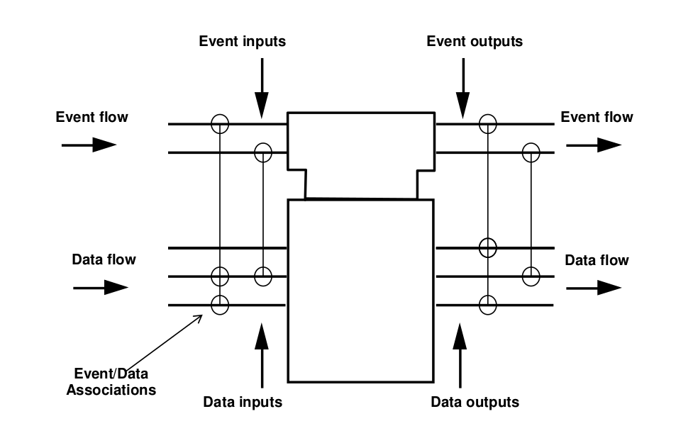

Funktionsblöcke können simpel sein (nur interne variablen, einem oder mehreren Algorithm und einem Execution Control Chart) oder komplex, also aus mehreren Funktionsblöcken zusammengesetzt.

Ein Funktionsblock arbeitet nun in folgenden Phasen:

#. Eingangswerte werden gesetzt
#. Ereignisse treffen ein
#. Ausführungskontrolle wird aktiviert
#. Algorithmus wird aktiviert
#. Algorithmus bestimmt aufgrund der Eingangsdaten und interner Daten neue Ausgangsdaten
#. Ausführungskontrolle erkennt Ende des Algorithmus
#. Daten werden an die Ausgänge gegeben
#. Ausgangsereignis wird erzeugt

Durch diese Funktionsblöcke soll weitere Abstraktion erreicht werden. Man soll sich auf die Applikationslogik konzentrieren können &rarr; Service Interface Function Blocks (entweder application- oder resource-initiated transaction)

Für Kommunikation zwischen mehreren Geräten sieht IEC 61499 Publish-Subscribe für unidirektionale Kommunikation und Client-Server für bidirektionale Kommunikation vor.

In Zukunft, wenn Intelligenz weiter in die einzelnen Knotenpunkte wandern soll, wird IEC 61499 immer relevanter.

# Profibus / Profinet

## Profibus

Ziel: weltweit standardisiertes Feldbussystem für bitserielle Kommunikation

Mnemonik: "\textbf{Pro}cess \textbf{Fi}eld \textbf{Bus}"

Profibus ist ein klassisches Feldbussystem und bietet daher mehr Funktionalität als ASi (klassischer Sensor-/Aktorbus) aber weniger Komplexität als z.B. KNX oder MAP

Charakteristik: virtuelle Geräte, also digital twins

EN 50170 Volume 2:
* Profibus-FMS: breiter Anwendungsbereich, mittlere Geschwindigkeit, eher kostspielig &rarr; bald Weiterentwicklungen
* Profibus-DP: (dezentrale Peripherie) plug&play, kostengünstig und effizient, gedacht für Fertigungsautomatisierung
* Profibus-PA: branchenorientierte Prozessautomatisierung, Eigensicherheit
* (Profibus-GA: Gebäudeautomation, bald abgelöst durch geeignetere Protokolle)

Im Aufbau hat man versucht durch ein "Baukastensystem" die diversen Subprotokolle (FMS, DP, PA) möglichst einheitlich zu gestalten.

## Profibus in IEC 61158 und IEC 61785

IEC 61158 und IEC 61785 spezifizieren eine Vielzahl von Kommunikationsprofilen. Profibus-DP und Profibus-PA haben darin Eingang gefunden.

* OSI-Schicht 7:
	* Applicationlayer-Protokolle
	* Applicationlayer-Dienste: Application Service Elements, Process Data, I/O, Diagnose, Alarme, Parametrierung, etc.
* OSI-Schicht 2:
	* Datalink-Protokoll: Fieldbus Data Layer (FDL) ist eine multimaster master-slave Zugriffssteuerung gepaart mit Token-Passing für Koordination der Master. Regelt wie mit mehreren Tokens zu verfahren ist, was passiert wenn ein Token verloren geht, Error-Handling, etc.
	* Datalink-Dienste: Send data with/without acknowledge, with/without reply, und clock sychronization
* OSI-Schicht 1: Twisted-Pair mit verschiedenen Übertragungsraten oder Lichtwellenleiter mit bis zu 12 Mbit/s, außerdem Spezifikation von Media Attachment Units (MAUs)

Topologie ursprünglich linienförmig, später auch Querstiche mittels Repeatern möglich. Pro Linie sind 32 Teilnehmer vorgesehen. Durch Repeater können maximal vier Linien verknüpft werden &rarr; $4 \cdot 32 - 3 = 122$ Teilnehmer maximal

Übertragungsverfahren:
* EIA-485\label{ref:eia_485}: Zeichen werden über Vorzeichen der Spannungsdifferenz zwischen zwei Leitungen identifiziert. Viele Teilnehmer können an diese zwei Leitungen angeschlossen werden. Leitungen müssen aktiv terminiert werden, sonst undefinierte Spannungspegel möglich.
* Bits sind Non-Return-to-Zero kodiert (NRZ)
* Unter anderem um lange Sequenzen von gleichen Werten zu vermeiden, werden UART-Character verwendet
* schlupffrei

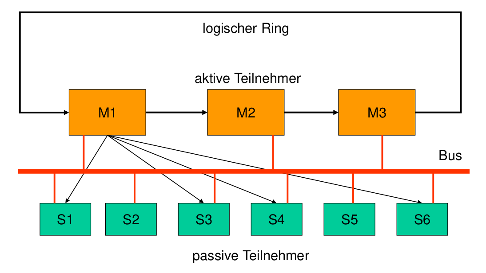

Wie in Abbildung \ref{fig:profibus_token_ring} dargestellt, ist Profibus ein Multi-Master-Slave-System, in dem die aktiven Teilnehmer -- also die Master -- ihre Zugriffe durch ein Token-Ring-Verfahren koordinieren. (Funfact: Token-Passing kommt aus der Zugfahrt, in der "Staffelstäbe" weitergereicht wurden um Kollisionen auf eingleisigen Abschnitten zu regeln.) Durch die FDL wird der Token-Ring automatisch angepasst, wenn Geräte hinzugefügt oder entfernt werden. Es wird sichergestellt, dass jeder Master genügend Zeit für seine Kommunikationsaufgaben hat. Eine Vielzahl an Fehlern kann erkannt werden. Durch große Hammingdistanz (HD=4) werden Nachrichten sehr sicher gegen Störanfälligkeit übertragen.

Durch die fixierte maximale Umlaufzeit des Tokens ist weist das System zeitlichen Determinismus auf und ist somit echtzeitfähig.

Datalink-Dienste:
* Send with Acknowledge: wichtig z.B. bei Weiterreichen von Token
* Send and Request Data: typischer Weg für Prozessdatenaustausch, Slave aktualisiert periodisch das Prozessabbild in Schicht 2, sodass sie unmittelbar auf Anfragen reagieren kann

Service Access Points: waren ursprünglich gedacht, dass Service Access Points (SAPs) mit beliebiger Funktion belegt werden können, aber in DP und PA wurde das reduziert: SAPs mit bestimmten Codes haben nur noch bestimmte Funktion (ähnlich wie OP-Code)

Profibus Geräteklassen:
* DP-Master Klasse 1: zentrale Steuerung. Typischerweise SPS oder Controller
* DP-Master Klasse 2: Projektierungs-, Engineering- oder Überwachungswerkzeug zur Inbetriebnahme der Slaves
* DP-Slaves

Betriebsphasen:
* Parametrierung: Master parametriert Slave und übermittelt unter anderem folgende Daten:
	* Verwendung von Watchdog
	* Station Delay Time
	* Freeze/Sync Modus unterstützt
	* Sperre für andere Master
	* Gruppendefinition
	* ...
* Konfiguration: Master übrprüfut gewünschte mit tatsächlicher Konfiguration eines Slaves
	* Anzahl der Ein-/Ausgangsdaten
	* Nutzdatenlänge
	* Herstellerspezifische Daten
	* ...
* Nutzdatenübertragungsphase

Parametrierung und Konfiguration durch proprietäre Tools führt zu Plattformproblematik, Inkompatibilitäten untereinander, keine konsistente Benutzerphilosophie, etc. Daher war in Profibus-DP von Anfang an der Wunsch nach einer einheitlichen Geräteintegration vorhanden &rarr; Gerätebeschreibungssprachen oder Gerätetreiber

Electonic Device Description: Technologieabhängiger Teil einer Gerätekonfiguration wird durch technologie\textbf{ung}abhängigen Teil beschrieben. Dadurch ich engineering aus einer einheitlichen Sichtweise heraus möglich.

Alternativer Ansatz um Einheitlichkeit zu schaffen: Feldgerät liefer Treiber mit. Steuerung geschicht ausschließlich über Treiber. Das geschieht in Profibus über Device Type Manager (DTMs) aus einer Rahmenapplikation heraus -- das ist das eigentliche Engineering-Tool -- angesprochen werden.

Die beiden unterschiedlichen Ansätze sind abstrakt in Abbildung \ref{fig:profibus_einheitliches_engineering} dargestellt. Die Einbettung eines DTM in eine Rahmenapplikation ist in Abbildung \ref{fig:profibus_dtm} zu sehen.

\begin{figure}
	\centering
	\includegraphics[width=0.475\textwidth]{./img/dezaut_profibus_geraeteabstraktion_sprache.png}
	\includegraphics[width=0.475\textwidth]{./img/dezaut_profibus_geraeteabstraktion_treiber.png}
	\caption{Zwei Ansätze um Engineering zu vereinheitlichen: Gerätebeschreibungen in eigenen Gerätebeschreibungssprachen oder Gerätetreiber \label{fig:profibus_einheitliches_engineering}}
\end{figure}

## Profinet

Nachdem Profibus erkannte, dass der Trend in Richtung "Industrial Ethernet" geht, wurde eine entsprechende Variante von Profibus entwickelt: Profinet

Ebenfalls in IEC 61158 aufgenommen

Drei Varianten:
* Best Effort (IP): Neben klassischem/industrial Ethernet wird IP als Kommunikationsstack integriert
* (Best Effort) Real Time: Teile der Applikation können direkt auf Layer 2 aufsitzen und damit echtzeitfähig sein.
* Isochrone Real Time: Eigener Scheduler sorgt für zeitlichen Determinismus (nicht mehr mit off-the-shelf Bauteilen möglich)

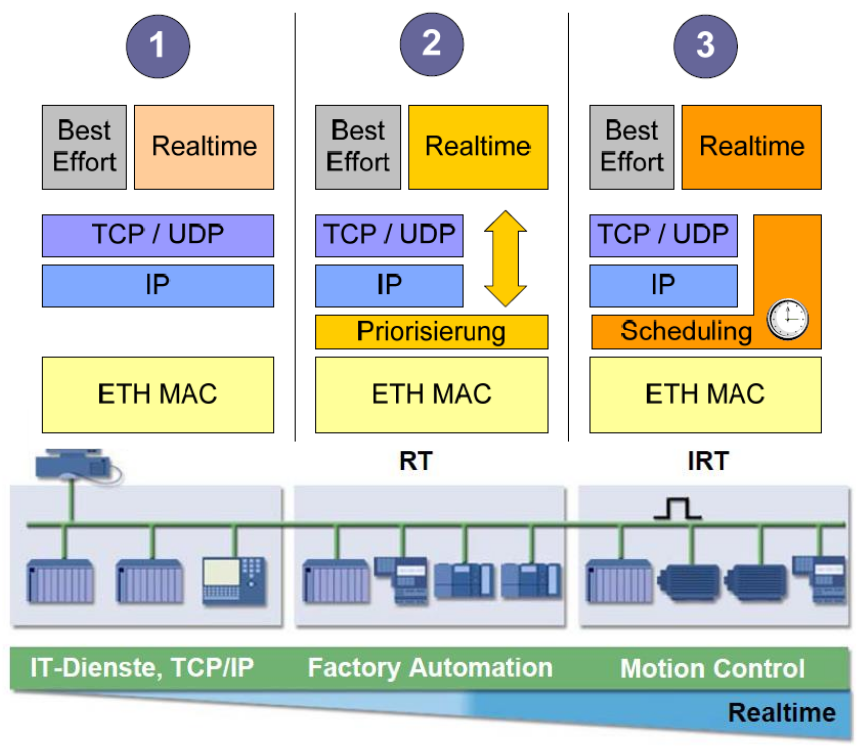

Netzwerkinstallation: Im wesentlichen ident zu Ethernet, also entwerde Dual-Twisted-Pair oder Lichtwellenleiter, aber es sind IP67-konforme Steckverbindungen nötig, also staubdicht und dicht bei kurzweiligem Untertauchen. Topologie flexibel.

Protokollstufen:
* IP: großer Overhead bei Datenübertragung durch Ethernet-Header und IP-Header
* Realtime: Overhead wird verringert, indem man auf IP-Header verzichtet und stattdessen virtual LANs aufzieht. Zyklische Nutzdatenübertragung und azyklische Meldungen/Alarme
* Isochron Realtime: Zwei Phasen für taktsynchrone, deterministische Kommunikation und Standardkommunikation. Sehr kurze Zykluszeiten

Das Gerätemodell orientiert sich an dem von Profibus:
* IO-Controller $\leftrightarrow$ DP-Master Klasse 1
* IO-Supervisor $\leftrightarrow$ DP-Master Klasse 2
* IO-Device $\leftrightarrow$ DP-Slave

Konfiguration von IO-Devices durch Slots, Subslots und Kanäle &rarr; sehr modular und flexibel

Protokolle recht umfangreich: z.B. benutzt IO-Supervisor Discover-Protokoll um neue IO-Devices zu entdecken

# InterBus (IEC 61158 Type 8)

Echtzeitfähiger Sensor-/Aktorbus: Kommunikation zwischen Feldgeräten mit übergeordnetem Kommunikationssystem in Echtzeit steht im Vordergrund. Wird gerne im Zusammenschluss mit anderen Protokollen für höhere Ebenen verwendet

Ebenfalls in IEC 61158 Aufgenommen

Merkmale:
* Feldgeräte auch über größere Distanzen über Fernbus erreichbar
* Hohe Protokolleffizienz durch Summenrahmenprotokoll
* keine Adress- oder Kontrollinformationen bei Übertragung nötig

Topologie: Ringförmig, jeder Teilnehmer fungiert auch als eine Art Repeater, zwei getrennte Leitungen für Hin- und Rückweg

Teilnehmer werden unterschieden in:
* Anschaltbaugruppe: Koppeln mit übergelagerte Steuerung und Fernbus
* Buskoppler: Kopplung zwischen Subsystemen

Fernbus: Überbrückung von großen Entfernungen (insges. bis zu 12.8 km), meist paarweise verdrillte und einfach geschirmte Leitungen oder auch Glasfaserkabel, Übertragungsverfahren EIA485 (siehe oben, Seite \pageref{ref:eia_485})

Vom Fernbus weg zweigen Lokalbusse ab -- also Peripheriebuss für kurze Distanzen aber viele Signale. Anknüpfung über "Smart Terminals" oder Inline Stationen mit diskreter Verkabelung. Es können auch Loop-Rings gebildet werden, die aus Sensoren und Aktuatoren mit geringer Datenbreite bestehen (soll auch Ausfallsicherheit bieten)

Komponenten:
* Anschaltbaugruppe: übernimmt gewissermaßen Master-Funktionalität und stellt Prozessdaten der Feldgeräte übergeordnetem System zur Verfügung, übernimmt auch Diagnosefunktion und steuer das zyklische InterBus-Protokoll.
* Buskoppler: Verbinden Segmente, setzen Signale um (z.B. auf andere Medien), versorgen meistens auch E/A-Module mit Betriebsspannung
* E/A-Module: für binäre, digitale oder analoge Signale

Zur Veranschaulichung ist eine mögliche Topologie in Abbildung \ref{fig:interbus_topologie} dargestellt.

Teilnehmeraufbau:
* vier Register:
	* Eingaberegister
	* Ausgaberegister
	* Identifikationsregister
	* Kontrollregister
* CRC-Generator und -Checker

In einem Identifikationszyklus werden Identifikationsregister zu großem Schieberegister zusammengeschlossen, wie in einer Daisy Chain. Der Master schiebt zuerst ein Loopback-Wort in den Ring und dann weitere Steuerbefehle bis er das Loopback-Wort wieder empfängt. Er hat dann die IDs von allen Teilnehmern im Ring empfangen. Die IDs geben Auskunft über Gerätegruppe, Datenbreite und beinhalten Mangement-Bits. Steuerdaten beinhalten Anweisungen zu auszuführenden Funktionen (z.B. (de)aktivieren von Segmenten oder resetten)

In einem Datenzyklus schiebt der Master ganz analog zuerst ein Loopback-Wort in den ersten Slave und dann die gewünschten Ausgabedaten. Wenn er wieder das Loopback-Wort empfängt hat er davor alle Eingabedaten der Slaves erhalten.

Das Protokoll sieht vor:
#. Identifkationszyklus Datensequenz (also wie oben beschrieben)
#. Identifikationszyklus Checksequenz (CRC-Checking)
#. Datenzyklus Datensequenz
#. Datenzyklus Checksequenz

Dadurch ist das InterBus ein sehr effizientes Protokoll: Die Effizienz liegt bei 60% und ist konstant (sinkt also nicht bei steigender Anzahl an Teilnehmern)

Signale:
* Bustakt
* Datensignal
* Select-Signal (Daten- oder ID-Zyklus)
* Control Signal (Daten- oder CRC-Phase)
* Reset-Signal

Signale werden in Telegramme eingebettet, aber nicht durch Register geschoben, sondern direkt an nächsten Teilnehmer weitergereicht mit nur minimaler Verzögerung

Datensicherheit:
* Select-Signal liegt nahezu zeitgleich an allen Teilnehmern an &rarr; Master muss selbst eigenes Select-Signal mit geringer Verzögerung korrekt erhalten
* Loopback-Wort
* CRC (Check-Sequenz)
* Timeout Kontroller
* Stopbit

Bei bekannter Anzahl an Teilnehmer ist Übertragungszeit bekannt und konstant &rarr; zeitlicher Determinismus, Echtzeitfähigkeit

Es können Teilnehmer auch über dieses Protokoll parametriert werden, aber Parametrierungsdaten müssen auf viele Zyklen aufgeteilt werden.

InterBus verfügut auch über einen Safety-Layer:

Sicherheit: Ausbleiben von unnanehmbaren Risiken (z.B. Gesundheitsschäden)

IEC 61508: Standardisierung von Verfahren über den gesamten Lebenszyklus von elektrischen, elektronischen oder programmierbaren Systemen um deren funktionale Sicherheit zu gewährleisten.

Durch angestrebte SIL (Safety Integrity Level) bestimmen sich anzuwenden Verfahren

VDI/VDE 2184: "Reliable operation and maintenance of fieldbus systems"

Zur Gewährleistung von funktionaler Sicherheit in InterBus wird das "Black Channel"-Prinzip eingesetzt, das Konformitat zu SIL 3 erlaubt. Dabei wird der Datenrahmen um ein Sicherheitsprotokoll erweitert.

Da die Konvergenz von Operational Technology und Informational Technology nicht aufzuhalten ist, sieht ProfiBus Anschaltbaugruppen vor, die Ethernet und ProfiBus koppeln. Dabei werden TCP/IP-Pakete Stückweise über ProfiBus als OSI-Layer 2 übertragen &rarr; zwar möglich aber langsam, hat sich am Markt nicht durchgesetzt.

Da sich diese Lösung nicht bewährt hat, wurde ein anderer Ansatz gewählt, nämlich der, dass InterBus in Profinet integriert wird und dort mittels virtueller IO-Devices abgebildet wird. Es können dazu folgende Ansätze gewählt werden:
* Transparente Integration: Jedes InterBus-Feldgerät wird durch ein eigenes IO-Device abgebildet. Dadurch sind Feldgeräte noch als diskrete Einheiten erkennbar, aber womöglich hohe Netzwerklast weil jedes Gerät eigenen Ethernetframe zur Verfügung gestellt bekommt.
* Kompakte Integration: Alle Feldgeräte werden durch ein einziges IO-Device mit einem einzigen Modul und einem einzigen Submodul abgebildet. Höhere Protokolleffizienz, geringere Netzwerklast, aber keine strukturelle Darstellung der InterBus-Teilnehmer möglich.
* Modulare Integration: Hybrid aus vorherigen Ansätzen. Alle Feldgeräte werden in einem einzigen IO-Device abgebildet aber jedes Feldgerät erhält eigenes Modul. Gute Effizienz, Eigenschaften der Teilnehmer stehen in Submodulen zur Verfügung, außerdem kein eigenes Konfigurationstool nötig.

# Automotive Control Networks

Typisches modernes Fahrzeug:
* > 10.000 elektronische Einheiten über 5 Kommunikationssysteme für Sicherheit, Komfort, Infotainment, Antriebssteuerung, etc.
* Vahicle-to-Vehicle-Kommunikation, Vehicle-to-Infrastructure

Anforderungen in unterschiedlichen Automationsdomänen:
* Comfort and basic service systems:
	* event-driven state-machines: Komplexität und Testbarkeit stellen Herausforderung dar
	* häufig CAN oder LIN
* Fahrwerk und Getriebe:
	* real-time-Anforderungen
	* fault tolerance und depandability
	* häufig CAN oder zeitgesteuerte Protokolle
* Sicherheitskritische Systeme:
	* safety-features
	* *harte* Echtzeitanforderungen
	* Fehlertolerenz
	* Determinismus verlangt
	* häufig FlexRay
* Multimedia/Infotainment:
	* hohe Bandbreite
	* MOST, Ethernet oder Funkbasierte Varianten

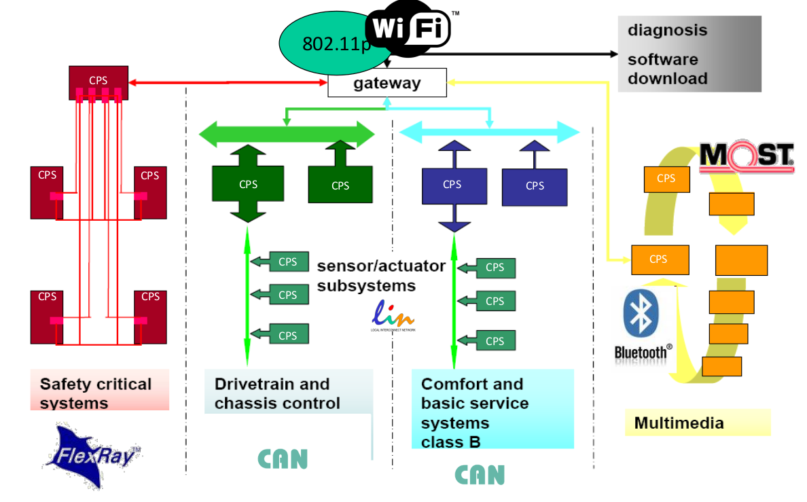

## CAN

CAN ist ein Hybrid zwischen klassischen Sensor/Aktor-Bussen und Feldbussen

Linienförmige Topologie, Multimaster, Nachrichtenorientierte Kommunikations (Nachrichten haben Identifier und Priorisierung)

OSI-Schichten:
* Schicht 7: Im Automotive-Bereich oft ausgelassen. Applikation sitzt direkt auf Schicht 2 auf
* Schicht 2: CSMA/CA mit Busarbitration nach Nachrichtenpriorität (außerdem Bitstuffing)
* Schicht 1: zwei unterschiedliche Ausprägungen für High-Speed/Low-Speed

CSMA/CA: Logisch 0 ist dominant, logisch 1 ist rezessiv. Teilnehmer legen gleichzeitig Arbitrierungsbits (=Priorität) an Bus an. Wenn ein Teilnehmer ein rezessives Bit anlegt, aber ein dominantes liest, steigt er aus dem Arbitrierungsverfahren aus. Am Ende bleibt nur mehr ein einziger Teilnehmer übrig.

Telegrammformate:
* Datentelegramm: Datenübertragung von einem Sender zu einem oder mehreren Empfängern (Producer-Consumer)
	#. Start-of-Frame-Bit
	#. Object-ID (11 Bit zur Arbitrierung)
	#. Request-Remote-Transmission-Bit (Unterscheidung zwischen Daten- und Datenanforderungstelegramm)
	#. Steuerfeld (6 Bit, z.B. Größe der Nutzdaten)
	#. Nutzdaten (bis zu 64 Bit)
	#. CRC-Feld (15 Bit)
	#. CRC-Acknowledge-Slot (3 Bit)
	#. End-of-Frame-Sequenz (7 Bit)
	#. (3 Bit Inter-Message-Gap)
* Datenanforderungstelegramm
* Fehlertelegramm: Signalisiert erkannten Fehler
	#. Fehlerflag (6-12 dominante Bits, würde normalerweise durch Bitstuffing unterbunden)
	#. Telegrammendezeichen
* Überlasttelegram

Fehlererkennung und -behandlung
* Bitmonitoring: Listen-while-talk, wurde mein rezessives Bit überschrieben?
* Überwachung des Telegrammformats
* CRC
* Überwachung der Bestätigungen
* Überwachung der Bitkodierung (Wurde Bitstuffing eingehalten?)

Fehlereingrenzung: Generieren Teilnehmer zu viele Fehlertelegramme wird er in den fehlerpassiven modus überführt, darf also nur noch rezessive Fehlertelegramme generieren. Generiert er weiterhin zu viele Fehlertelegramme, wird er vom Bus entfernt

### TT-CAN

CAN an sich bietet wenig zeitlichen Determinismus und Echtzeitfähgkeit &rarr; TT-CAN

baut auf CAN auf aber bietet Scheduling für Nachrichten in Zyklen in Slots.

Basic Cycle wird unterteilt in:
* Reference Frame (wird vom Zeitmeister gesendet)
* Exclusive Time Window: statisches scheduling
* Arbitrating Time Window: Teilnehmer konkurrieren um Medium wie in klassischem CAN
* (Free Time Window für spätere Erweiterungen)

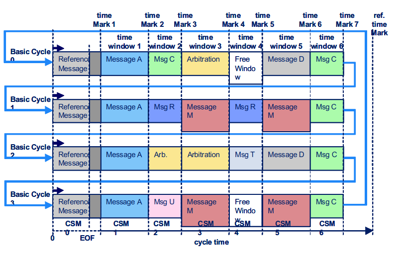

## LIN

CAN hat sich zwar bewährt, war aber noch recht kostenintensiv &rarr; Local Interconnect Networt (LIN) als preiswerteres System

Einzelne Leitung zur Datenübertragung (wenig Verkabelungsaufwand), vergleichsweise geringe Datenrate (19.2 kBit/s), Leitungslänge max. 40m, Halbduplex-verfahren für single-master-multi-slave

LIN-Frame recht einfach gehalten:
#. 13 Bit Synchronisationsbreak (durchgehend low)
#. Synchronisationsbyte 0x55
#. Identifier kodiert Richtung, Bedeutung und Länge des Datenfeldes
#. Response: 1-8 response-Datenbytes und Checksumme

Frame-Typen: //todo

LIN-Framework (Tools Chain):
* Knoten werden in Node Capability File (NCF) beschrieben (ähnlich zu Electronic Device Description)
* Cluster und Netzwerkbeziehungen werden in LIN Description File (LDF) beschrieben
* Generator-Software erzeugt aus LDF die Software für die einzelnen Komponenten
* Für Anwendungen steht eine C-API zur Verfügung

Was passiert, wenn Master ausfällt? &rarr; gesamtes System steht still

## FlexRay

Hohe Übertragungsrate (10 Mbit/s), deterministische Übertragung und garantierte Latenzzeiten, synchrone vs. asynchrone (event-gesteuerte) Nachrichten, optische und elektrische Medien, flexible Topologie, unterstützt redundante Kommunikationsnetze, Fehlereindämmung (z.B. gegen Babbling Idiots) auf Bitübertragungsschicht durch Bus-Guardian

Knotenaufbau (Abbildung \ref{fig:automotive_flexray_knotenaufbau}):
* Host: beheimatet Anwendungssoftware, konfiguriert Bus-Guardian und Bus-Driver
* Communication Controller: implementiert FlexRay-Protokoll, Schnittstelle zwischen Host und Bus
* Bus Driver: Anpassung der Daten an Medium
* Bus Guardian: Überwachung, erkennt Babbling Idiot

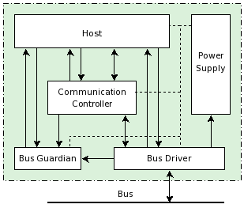

Kommunikationszyklus:
#. Statisches Segment
#. Dynaisches Segment
#. Symbol Window (z.B. für Wake-Up)
#. Network Idle Time

Im statischen Segment wird Zugriff über TDMA geregelt, im dynamischen mit *flexible* TDMA  (FTDMA): Teilnehmer konkurrieren um Übertragung. Höchstpriorer Frame gewinnt, mehrere Minislots werden zu Slot mit passender Länge zusammengebunden.

# Gebäudeautomation

ISO 16484-3: Gebäudeatuomation ist ein "System aus Produkten und Dienstleistungen für automatische Steuerung und Regelung, Überwachung, Optimierung, Betrieb sowie für manuelle Eingriffe und Management zum energieeffizienten, wirtschaftlichen und sicheren Gebäudebetrieb"

Herausforderungen:
* Stochastische Störgrößen
	* Wechselnde Witterungsverhältnisse, Personenanzahl, Verhalten, Geräteabwärme (PCs, Beleuchtung)
	* Oft händischer Eingriff nötig (z.B. Luftumwälzung Hörsaal)
* Kostensensitiv
* Lange Lebenszyklen
	* Technisch konservativ (aber zukunftssicher)
	* Ausschreibungen verlangen oft Normenkonformität
* Potentiell außerordentlich große Ausdehnung
	* Lokalität der Daten hoch &rarr; Dezentraler Ansatz

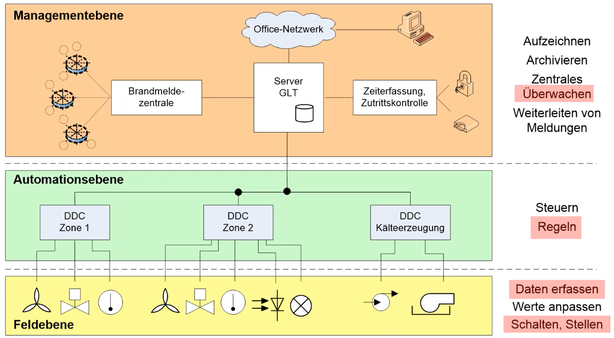

Von dieser dreistufigen Pyrimade hat sich eine Architektur mit zwei Ebenen entwickelt, da Feldgeräte zunehmen intelligenter werden und auch Automationsaufgaben übernehmen können.

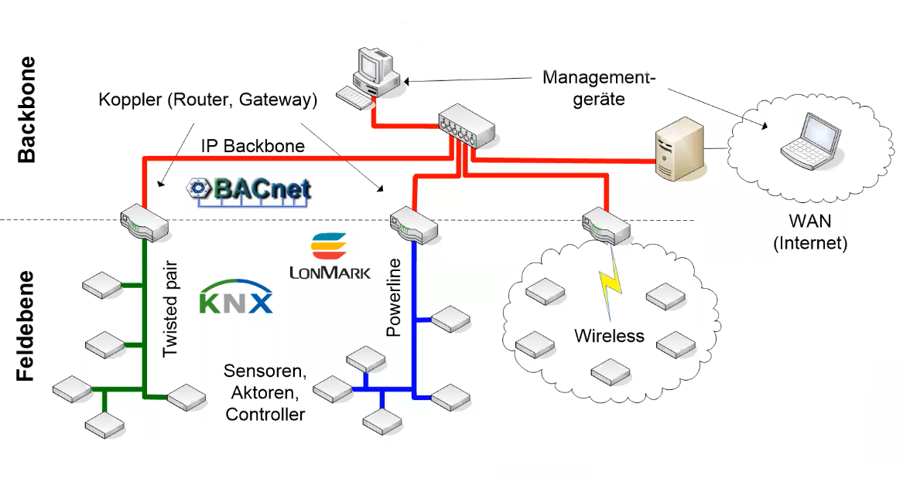

## KNX

Topologie:
* 3 Ebenen: Backbone, Hauptlinien, Sublinien
* Individuelle Adressen und Gruppenadressen
* Kontralldatenaustausch via Publish-Subscribe
* Engineering-datenaustausch via Client-Server

KNX-Geräte: Applikationsmodule setzen auf generischen Bus Coupling Units auf, die Protokol implementieren. Host-Controller sprechen TPUART-Controller über UART an, der KNX Layer 1 und 2 implementiert.

Interoperabilität wird durch Interworking-Prinzip gewährleistet: Funktionen werden nach mehreren Kriterien klassifiziert:
* Anwendungsbereich (z.B. HLK)
* Anwendungsmodell (z.B. Heizung)
* Funktionsblock (z.B. Warmwasserkessel)
* Datenpunkt (z.B. Temperatur-Sollwert)
* Datenpunkt-Typ (z.B. 2 byte fließkommatyp in °C)

## LonWorks

Ziel: allgemein anwendbares, ereignisgesteuertes, embedded 	Netzwerk für Steuerungszwecke. (Anwendungsbereich in Gebäudeautomation war ursprünglich nicht im Fokus)

LonWorks umfasst drei Entitäten:
* LonTalk-Protokoll
* Neuron-Chip aus drei Controller zur Umsetzung des Protokolls
* Engineering-Tool

Prinzip: Datenbestände über Netzwerkvariablen austauschen

Topologie: freier gestaltbar als bei KNX. Domänen als Netzwerke, unterglieder in Subnetze, zwischen denen mittels Routern kommuniziert wird. Für Kommunikation über Domängrenzen hinweg sind Gateways verantwortlich. Viele verschiedene Möglichkeiten der Adressierung (Node ID, Domäne-Subnetz-Node, Domäne-Gruppe)

Datenübertragung:
* Unacknowledged
* Unacknowledged repeated
* Acknowledged
* Request/Response

Austausch von Netzwerkvariablen: z.B. Funktionsblock für Schalter stellt ausgangsseitig Netzwerkvariable zur Verfügung, die den Status des Schalters wiedergibt (on/off). Die Variable wird eingangsseitig an den Funktionsblock einer Lampe gebunden.

## BACnet

"Building Automation and Control Network"

Während KNX und LonWorks eher auf der Feldebene agieren, ist BACnet in der Managementebene beheimatet und reicht in die Automationsebene hinein.

Ziel: Daten zentral sammeln, Alarm- und Ereignismanagement, Kontrollaufgaben

kann lizenzfrei implementiert werden und schreibt keine Netzwerktechnologie vor und zielt eher auf Applikationsobjekte ab.

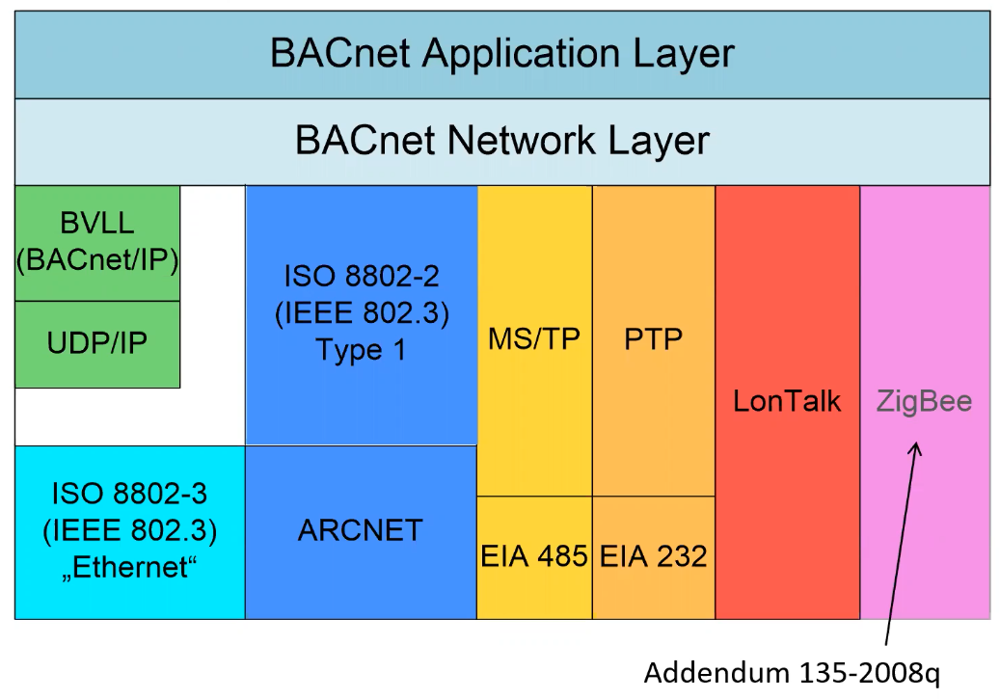

Auf Applikationsebene sind BACnet-Objekte definiert, die mehrere verpflichtende oder optionale Properties festlegen. Über diese Objekte ist der Datenfluss geregelt

# Common Industrial Protokol

Die bislang besprochenen Kommunikationssysteme sind meist nur in einer bestimmten Ebene der Automationspyramide anwendbar. Das Common Industrial Protocol (eigentlich eine ganze Protokollfamilie) versucht nun einen Standard über mehrere Ebenen hinweg darzustellen. Die Schwelle zwischen Operational und Informational Technology soll dadurch leichter überwindbar werden.

Ebenfalls in IEC 61158 und IEC 61784 aufgenommen.

Kern: alle CIP-Teilnehmer vervügen über gleiches "Vokabular". Werte können in diesem Vokabular über verschiedene Kommunikationssysteme übertragen werden. Dadurch muss nur noch zwischen den diversen Medien übersetzt werden, aber nicht auf Applikationsebene

Umsetzung:
* Ethernet in Information Technology
* ControlNet auf Feldebene
* DeviceNet auf installationsebene

Wie in Abbildung \ref{fig:cip_osi} dargestellt, verwenden alle Umsetzung von CIP die gleichen Applikationsschichten, die Geräteprofile definieren	und Objekte. Geräte von gleichem Profil weisen gleiches Verhalten an der Schnittstelle auf.

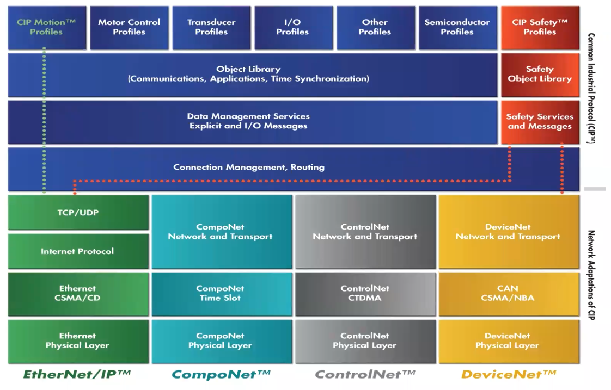

CIP setzt auf abstrakte Objekte zur Beschreibung von Knoten/Teilnehmer. Jeder Teilnehmer verfügt über mehrere Gruppen/Objekte, die die verfügbaren Kommunikationsdienste beschreiben. CIP-Objekte sind wie Klassen, die instanziert werden und Attribute haben. Adressierung über Knoten-ID, Objektinstanz und Attribut

Das CIP Messaging Protocol ist verbindungsorientier und basiert auf Connection-Objects, die den Datentransfer durchführen. Die Objekte werden in der Anlaufphase aufgebaut. Die Connection-Objects können für implizite oder explizite Nachrichten sorgen. Implizite Nachrichten werden periodisch versendet und werdem dem Producer-Consumer-Paradigma gerecht, daher sind diese Objekte entweder producing oder consuming. Explizite Nachrichten haben ein Request-Response-Schema (also Client-Server).

Die Object-Library beschreibt nun viele solcher CIP-Objects, die sehr einheitlich gehalten sind. Eine Besonderheit sind sogenannte Assembly-Objekte, die als Multiplexer für Nachrichten dienen. Durch sie können mehrere Objekte gebündelt werden, wodurch der Overhead und die Netzwerklast geringer werden.

## DeviceNet

War erste Implementierung von CIP. Basiert auf CAN, erweitert dieses aber um einige Schichten

Topologie: Baum- und Sternförmig mittels twisted-pair-Busses

Steckverbindung IP-20/65/67-konform

Interessante Verbindungsart: Bitstrobe: Master sendet Multicast an mehrere Slaves (braucht deswegen nur einen Communication-Identifier) und die Slaves antworten mit individuellen CID. (vergleichbar mit LIN?)

## ControlNet

Nutzt für Medienzugriff CTDMA (Cuncurrent Time Multiple Access), wurde entworfen für Übertragung von Ein- und Ausgangsdaten, die nicht unter Übertragung von anderen Nachrichten leiden soll. Zeitscheibenverfahren. Unterscheidung zwischen zeitkritischen und zeitunkritischen Daten. Zeitkritische Nachrichten werden gescheduled, unkritische werden mittels round-robin geregelt.

Scheduling wird über implizites Token-Verfahren geregelt; implizit weil es keinen Master gibt der den Vorgang steuert und überwacht, sondern jeder Knoten muss selbst wissen, wann er dran ist &rarr; Uhrensynchronisation nötig. Höchstpriorer Knoten beginnt und gibt Token dann an nächsten weiter (eigentlich erkennt der nächste dass der vorherige seine Übertragung abgeschlossen hat). Zyklusdauer ist so gewählt, dass jeder Teilnehmer genügend Zeit für seine Kommunikationsaufgabe hat.

Nach Ablauf der scheduled messasges wird restliche Zykluszeit für unscheduled messages genutzt. Damit es nicht zu Starvation kommt, wird in jedem Zyklus ein Counter inkrementiert (mit wrap-around), der angiebt, welcher Teilnehmer mit der Übertragung seiner expliziten Nachrichten anfangen darf.

## Ethernet/IP

Switched Ethernet mit TCP/UDP

Kaum Echtzeitfähigkeit, dafür einige Funktionen für funktionale Sicherheit

Einfache Integration in Information Technology (z.B. SCADA-Systeme)

Unterschiedliche Connection Classes für Übertragung von CIP-Objekten über Ethernet/IP. Klassen unterscheiden sich z.B. in Datensicherheit, also ob es Empfangsbestätigungen gibt oder ähnliches. Implizete Nachrichten werden über UDP gekapselt, explizite über TCP (Protokolleffizienz recht gering)

Hersteller stellen APIs als Schnittstelle zur Verfügung zur Gestaltung von Anwendungen

# Wireless Communication

Sind im Alltag cool, bieten aber auch attraktive Möglichkeiten in der Automation.

Vorteile:
* Geringere Verkabelungs- und Wartungskosten
* Weniger Ärger mit Kabelbrüchen oder Steckverbindungen

Nachteile:
* Datenübertragung störanfälliger

IEEE 802.15.4: Beschreibt Physical und Data-Link Layer für viele funkbasierte Technologien

IEEE 802.11: Wifi, klassisch in Information Technology, 2.4 oder 5 GHz, Infrastruktur in Form von Accesspoints und drahtgebundenem Netz nötig

Mit Bluetooth weden Piconetze im Master-Slave-Prinzip kommuniziert

Bluetooth und Wifi sind im ISM-Frequenzband beheimatet (Industrial, Scientific, Medical), das um 2.4GHz liegt. Um Interferenz zu verhindern nutzt Bluetooth "frequency hopping", also Teilnehmer sind nur für sehr kurze Zeit in einem Schmalen Frequenzband und wechseln nach Sekundenbruchteilen zu anderem Band

Auch im Automotive-Bereich werden kabellose Verbindungen immer gebräuchlicher, z.B. in Car-to-Car- oder Car-to-Infrastructure-Kommunikation. Dafür wird meist die Variante 802.11p eingesetzt.

In Gebäudeautomation sind kabellose Verbindungen nützlich, um keine neuen Leitungen verlegen zu müssen oder aus ästhetischen Gründen in Glasbauten.

In der Industrie sind kabellose Verbindungen dort sinnvoll, wo Sensoren/Aktuatoren nur schwer verkabelt werden können oder wo lange Kabel zu Explosionsgefahr führen könnten, oder auch um mobile Knoten zu realisieren.

Eine große Rolle in Wireless spielt Energieeffizienz damit Knoten, die nur über eine Batterie oder Energy-Harvesting betrieben werden, nicht laufend gewartet werden müssen &rarr; Hardware-Software-Codesign, sehr häufiger Gebrauch von Ruhemodi oder auch Transmitt-Only-Devices

Üblicherweise geringere Datenrate als in kabelgebunden Verbindungen und weit weniger vorhersehbar, störanfälliger

Carrier-Sense Problem. Was ist wenn ein Knoten $\mathcal{B}$ zwei andere Knoten $\mathcal{A}$ und $\mathcal{C}$ wahrnehmen kann aber $\mathcal{A}$ und $\mathcal{C}$ nicht einander? Dann könnten $\mathcal{A}$ und $\mathcal{C}$ gleichzeitig senden, da sie glauben, das Medium nützen zu dürfen, aber $\mathcal{B}$ empfängt nur gestörte Daten wegen Interferenz. Lösungsansatz: Request-to-Send/Clear-to-Send

Exposed-Terminal-Problem: $\mathcal{A}$ und $\mathcal{B}$ möchten miteinander kommunizieren und $\mathcal{C}$ und $\mathcal{D}$. Obwohl es theoretisch möglich wäre, dass gleichzeit $\mathcal{A}$ an $\mathcal{B}$ und $\mathcal{C}$ an $\mathcal{D}$ sendet, kann es sein, dass z.B. $\mathcal{C}$ mitbekommt, dass $\mathcal{A}$ sendet und beginnt daher seine eigene Übertragung nicht (Verlust von Parallelisierung)

Weitere Gründe für Interferenzprobleme: Viele Technologien konkurrieren um ISM-Frequenzband. Brechung und Reflexion an Objekten.

Wireless Technologien haben auch Security-Probleme: Ein Angreifen, der Nahe an den Netzwerken sitzt, kann Kommunikation abhören oder auch stören.

7 wireless myths
#. The world is flat.
#. The radio transmission area is circular.
#. All radios have equal range.
#. If I can hear you, you can hear me. (symmetry)
#. If I can hear you at all, I can hear you perfectly. (all or nothing)
#. The signal strength is a simple function of distance.
#. Link quality does not change.

Topologien (Abbildung \ref{fig:wireless_topology}):
* Sternförmig: klassisch wie bei WLAN-Access-Point
* Hybrid Mesh
* Full Mesh: eng vermaschte Topologie &rarr; erhöhte Ausfallsicherheit durch redundante Pfade

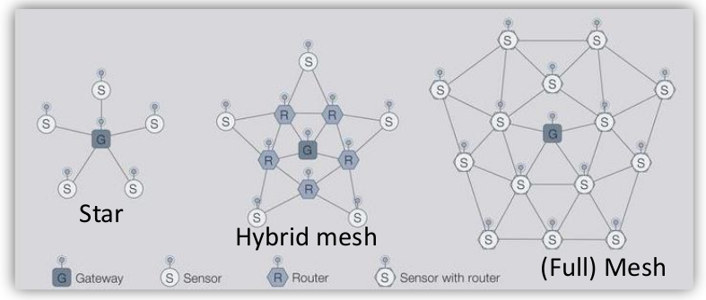

Wireless Sensor Networks

Medium für Wireless Communication: Elektromagnetisches Feld (aber nur sehr kleiner Teil davon)

Um nun Interferenz mit anderen Technologien auf heiß umkämpften Medien zu verhindern wird gemultiplext. Dies kann in vier Dimensionen stattfinden:
* Space
* Time
* Frequency
* Code: Gleichzeitige Übertragung über gleiches Frequenzband. Kanäle unterscheiden sich durch Kodierung. Komplex, da Kodierungen unabhängig sein müssen
* Hybride wie Time- and Frequency Multiplexing

## IEEE 802.15.4

Protokoll-Stack, der Pyhsical und Data-Link Layer definiert, sodass weitere Technologien darauf aufbauen können, spezifisch für Sensor-/Aktornetze ausgelegt.

Geringe Kosten, aber auch geringe Reichweite und Übertragungsrate. Geringer Energiekonsum, aber sehr flexibel und offen

Einteilung der Geräte in
* Full Function Devices: alle Funktionalitäten, meist zur Koordination genützt, externe Energieversorgung, können sowohl mit FFDs als auch mit RFDs kommunizieren
* Reduced Function Devices: weniger Funktionen, wenig Energieverbrauch, können nur mit FFDs reden

Adressierung entweder über 16 Bit Short Address und 16 Bit PAN ID, oder über 64 Bit Long Address

Zwei Modi:
* Non-Beacon-Enabled: CSMA/CA, freier Zugriff auf Medium
* Beacon-Enabled: Superframe-Structure wird von Beacon eingeleitet: danach Contention-Period, in der Teilnehmer mittels CSMA/CA um Medium konkurrieren, und Contention-Free-Period mit garantierten Time-Slots für Teilnehmer. Wichtig: Diese garantieren dennoch keine Echtzeitfähigkeit, da externe Geräte die Übertragung jederzeit stören könnten. Beacon kann zur Synchronisation verwendet werden.

Zwei Daten-Transfer-Möglichkeiten:
* Indirekt: Geräte fordern als Client Daten vom Koordinator als Server an. Vorteil: Andere Geräte können in den Energiesparmodus wechseln
* Direkt: peer-to-peer. Energiesparmodus nur mit beacon-enabled möglich

802.15.4 stellt auch primitive Sicherheitsmechanismen zur Verfügung wie Authentifikation (MACs), Autorisierung, Verschlüsselung, etc.

# Industrial Ethernet / Industrial Internet

Ziel von Industrie 4.0: Intelligente Wertschöpfungsketten unter Berücksichtigung des Lebenszyklus eines Produktes

Ethernet ist großer Erfolg in IT, also möchte man es mit OT homogenisieren &rarr; Konvergenz und vertikale Integration

Homogenisierung und vertikale Integration führen zu Kollaps der klassischen Automationspyramide auf bloß zwei oder drei Ebenen

Damit Legacy-Systeme auf der Feldebene weiterhin bestehen bleiben können -- zumindest vorerst -- gibt es drei Ansätze:
* Feldbusprotokolle über Ethernet tunneln. Dafür ist natürlich bestimmter Router nötig, der zwischen den Protokollen übersetzt. Führt dazu, dass man auf IT-Ebene sich mit Details der Feldgeräte herumschlagen muss
* Ethernet-Pakete über Feldbus tunneln: Feldgeräte müssen dann natürlich IP-Stack implementieren. Hoher Ressourcenbedarf, wenig Effizienz, dafür aber keine nitty-gritty details auf IT-Ebene über Feldgeräte nötig.
* Gateway: übersetzt zwischen OT und IT. Es wird also nicht getunnelt, sondern sauber getrennt und in jeder Ebene das Protkoll angeboten, das für die Ebene charakteristisch ist. Höherer Engineering-Aufwand

Oder man trennt sich von Legacy-Systemen und klassischen Feldbussystemen und nimmt direkt Industrial Ethernet. Kosten? Echtzeitfähigkeit? 

Ethernet definiert Layer 1 und 2. Auf Layer 2 wird CSMA/CD (listen before talk) verwendet &rarr; Kollisionen müssen womöglich aufgelöst werden, schlechte Echtzeitfähigkeit, Thrashing

Durch switched Ethernet werden Kollisionsdomänen gebildet. Probleme durch Kollision minimiert. Aber switches sind bottle-necks.

Effizienz: Großer Overhead durch Header für alle möglichen OSI-Schichten. Bsp für 8 Byte Nachricht: 11%

Wegen der geringen Effizienz und dem Mangel an Echtzeitfähigkeit ist Industrial Ethernet speziell adaptiert.

Man kann TCP-Pakete über InterBus tunneln, oder es auch CIP-kompatibel ausstatten.

## Ethernet Powerlink

Setzt auf Ethernet auf und legt darüber aber zyklischen Datenaustausch mit Master-Slave. Bus-Master ist single point of failure. Zyklisches Polling (etwa wie bei ASi)

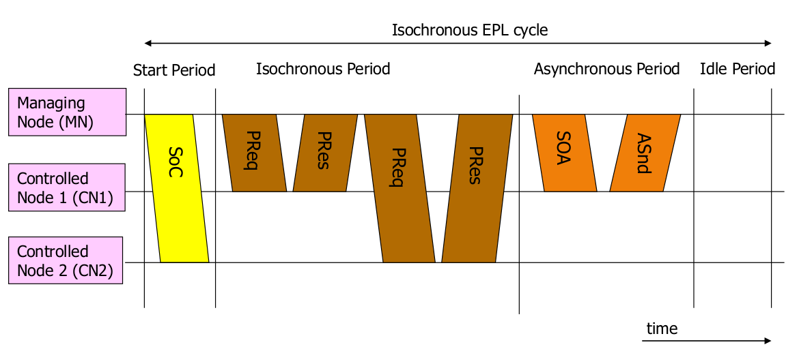

## TCnet

Unterteilung in High-, Medium- und Low-Speed-Phasen. In jeder Phase bekommen Teilnehmer Zeit um mit anderen Teilnehmern zu kommunizieren und signalisieren durch Complete-Flag, dass sie ihre Kommunikation für diese Phase abgeschlossen haben.

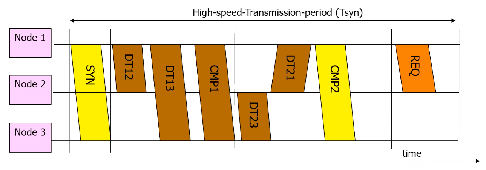

## EPA (Ethernet for Plant Automation)

Unterteilung in Makrozyklen. In jedem Makrozyklus bringen Teilnehmer der Reihe nach ihre Daten auf den Bus auf. Nach jeder Nachricht, gibt Teilnehmer an, ob er Bedarf hat, später auch azyklische Nachrichten zu senden.

## EtherCat

Summenrahmenprotokoll ähnlich zu InterBus. Teilnehmer reichen Telegramme reihum weiter. Nicht kompatibel zu klassischem Ethernet

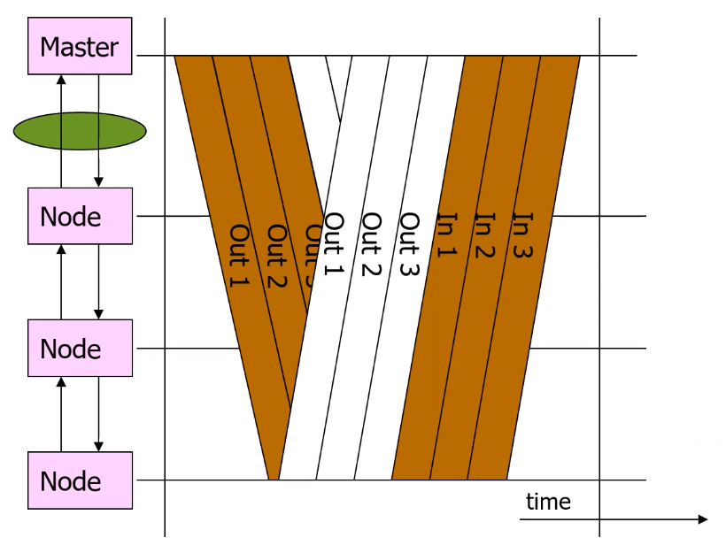

## ProfiNet IO

Erinnerung: ProfiNet bietet neben TCP/IP-Channels auch Channels für Soft-Realtime und Isochronous Realtime

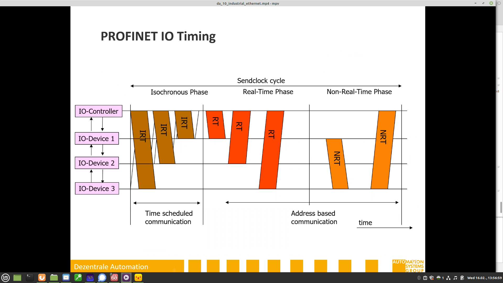

## Zukunftsaussichten von Industrial Ethernet

* Erleichterung von vertikaler Integration
* Ersetzen von Feldbusebene
* Einfache Integration von TCP/IP
* Koexistenz von Office- und Automationsapplikationen

aber

* kein Ersatz für Feldbusse im untersten Bereich (Sensor-/Aktornetzwerke)
* nicht so kostengünstig wie erhofft/behauptet
* kaum Eigensicherheit möglich

Kluft zwischen IT und OT wird sich weiter verringern

Als Übergangslösung kommen oft Webservices zum Einsatz. Durch service-basierte Strukturen statt monolithischen Strukturen lassen sich komplexe Anwendungen wie aus dem Baukasten zusammenstöpseln.

## Time Sensitive Network (IEEE 802.1Q)

Standards zu Scheduling und Traffic Shaping

Garantiert Echtzeitfähigkeit und könnte somit ein starker Konkurrent von Industrial Ethernet sein

"A toolbox for open standards"

:::comment
	Fragen:
		unterschied feldebene, installationsebene, sensor/aktorebene
		unterschied client-server vs master-slave und publish-subscribe vs producer-consumer
		wieso interbus protokolleffizienz 60%?
		fehlereingrenzung bei CAN: wer kontrolliert was?
:::
